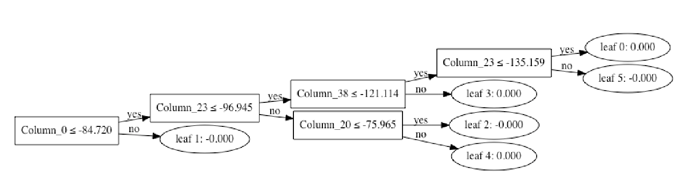
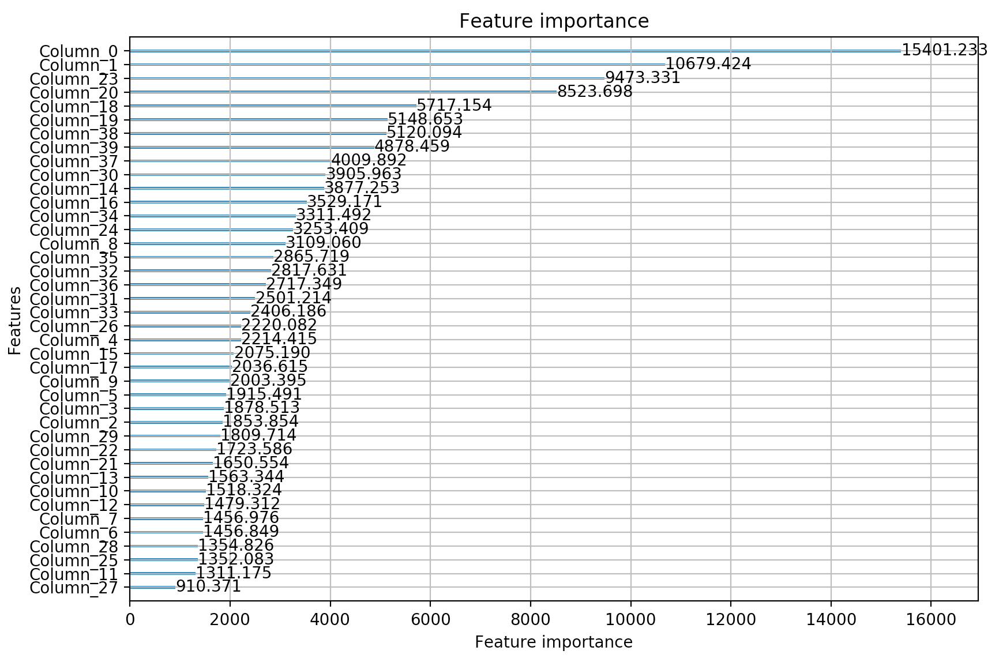

# kck2019

**Rozwiazania do przedmiotu "Komunikacja Człowiek-Komputer" (KCK)
[https://www.cs.put.poznan.pl/mtomczyk/index.php/sample-page/komunikacja-czlowiek-komputer-sem-5/](https://www.cs.put.poznan.pl/mtomczyk/index.php/sample-page/komunikacja-czlowiek-komputer-sem-5/).**

**Ten projekt ma na celu jedynie przechowanie moich rozwiazan.**

- Zadania:
  - [zadanie 1](#zadanie-1): wykres
  - [zadanie 2](#zadanie-2): sympy/wyliczenia
  - [zadanie 3](#zadanie-3): gradienty + wizualizacja mapy
  - [zadanie 4](#zadanie-4): rozpoznawanie samolotow (bez machine learning-u)
- Projekty:
  - [projekt 1](#projekt-1): rozpoznawanie planszy (szachy)
  - [projekt 2](#projekt-2): rozpoznawanie plci z dzwieku
  - [projekt 3](#projekt-3): aplikacja do badania progresu treningu

---

## Zadanie 1

```bash
$ python3 bin/1.py
```

<p align="center">

</p>

## Zadanie 2

```bash
$ python3 bin/2.py > lab2.out
```

output: [[lab2.out](lab2.out)]

<p align="center">

</p>

## Zadanie 3

```bash
$ python3 bin/3a.py # gradienty
$ python3 bin/3b.py # mapa
```

Gradients             |  Map [[pdf]](map_final.pdf)
:-------------------------:|:-------------------------:
  |  

## Zadanie 4

```bash
# przerobi wszystko co znajduje sie w data/planes
$ python3 bin/4.py # map_final.pdf (dobra jakosc)
```


## Projekt 1 (vision)

Implementation             |  Result
:-------------------------:|:-------------------------:
**Projekt:** https://github.com/maciejczyzewski/neural-chessboard <br> **Raport:** https://arxiv.org/abs/1708.03898 | 

## Projekt 2 (audio)

Decision Tree             |  Features
:-------------------------:|:-------------------------:
  |  

```bash
# przygotowanie & weryfikacja:
$ python3 bin/5.py --dataset
$ python3 bin/5.py --train
$ python3 bin/5.py --test
# odpalenie dla pojedynczego pliku:
$ python3 bin/5.py --do --path=data/myaudio/chyba_dziala_M.wav
```

## Projekt 3 (prototype)

Implementation             |  Result
:-------------------------:|:-------------------------:
**Projekt:** https://github.com/maciejczyzewski/slonie_w_pontonie |  
